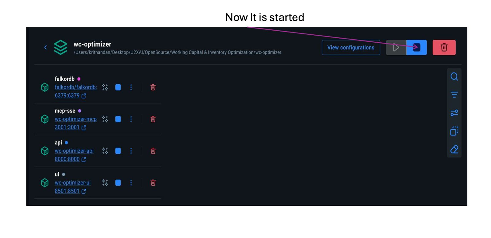
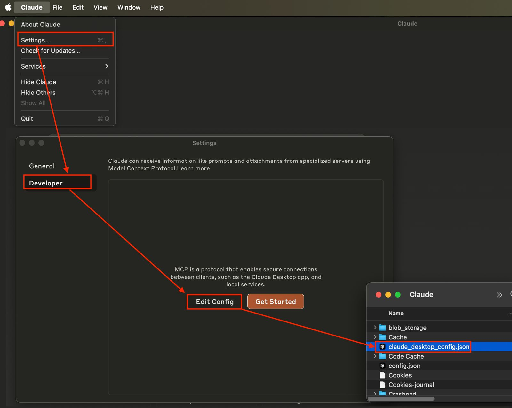
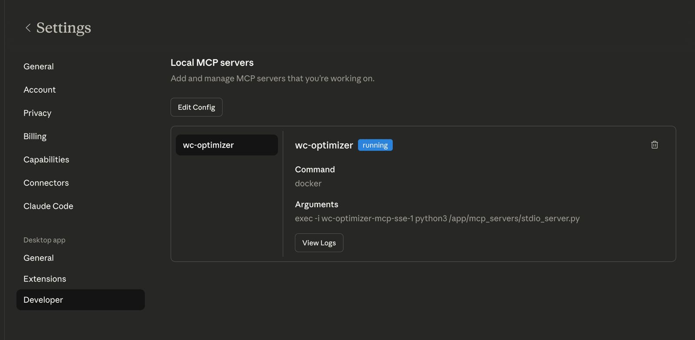
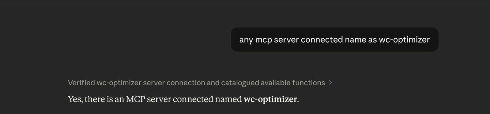

# WC Optimizer 💰

> **AI-Powered Working Capital & Inventory Optimization Platform**

Unlock cash trapped in your supply chain by analyzing inventory, receivables, and payables through the **Cash Conversion Cycle (CCC)** framework. Ask questions in plain English and get instant insights — all data stays on your machine.

[](https://opensource.org/licenses/MIT)
[](https://www.python.org/)
[](https://www.docker.com/)
[](https://modelcontextprotocol.io/)

---

## 🎯 What Is WC Optimizer?

**WC Optimizer** is an open-source platform that turns your raw supply chain CSVs into actionable working capital intelligence. Upload your data once, then query it through Claude Desktop, Cursor IDE, or the built-in web dashboard.

**Example questions you can ask:**
- *"Which products should I reorder this week?"*
- *"How much cash is tied up in slow-moving inventory?"*
- *"If I reduce my DSO by 5 days, how much cash is freed?"*
- *"Which suppliers have the highest failure risk?"*

> **Privacy first:** All processing happens locally inside Docker. No data is sent to any cloud.

---

## 📐 Architecture

```
┌─────────────────────────────────────────────────────┐
│                  Your Machine                        │
│                                                     │
│  ┌──────────┐   ┌──────────┐   ┌─────────────────┐ │
│  │ Streamlit│   │ FastAPI  │   │  MCP SSE Server │ │
│  │ UI :8501 │──▶│ API :8000│──▶│  :3001          │ │
│  └──────────┘   └──────────┘   └────────┬────────┘ │
│                      │                  │           │
│               ┌──────▼──────┐   ┌───────▼───────┐  │
│               │   DuckDB    │   │   FalkorDB    │  │
│               │ (Analytics) │   │   (Graph DB)  │  │
│               └─────────────┘   └───────────────┘  │
└─────────────────────────────────────────────────────┘
         ▲                    ▲
   Claude Desktop          Cursor IDE
   (via docker exec)    (via SSE or docker exec)
```

---

## 📋 Prerequisites

**Only Docker Desktop is required.** Everything else runs inside containers.

### Install Docker Desktop

| OS | Download | Verify |
|----|----------|--------|
| **macOS** | [docker.com/products/docker-desktop](https://www.docker.com/products/docker-desktop) | `docker --version` |
| **Windows** | [docker.com/products/docker-desktop](https://www.docker.com/products/docker-desktop) | `docker --version` |
| **Linux** | [docs.docker.com/engine/install](https://docs.docker.com/engine/install/) | `docker --version` |

After installing, open Docker Desktop and wait for the whale icon 🐳 to appear in your menu bar/system tray.

---

## 🚀 Quick Start

### 1. Get the Code

```bash
# Option A: Git clone
git clone https://github.com/kritnandan/Working-Capital-Inventory-Optimization-.git
cd Working-Capital-Inventory-Optimization-

# Option B: Download ZIP from GitHub, extract, then:
cd wc-optimizer-main
```

### 2. Start All Services

```bash
docker compose up
```

<p align="center">
  
</p>

First run downloads images (~2–5 min). Wait for:
```
wc-optimizer-ui-1   | You can now view your Streamlit app in your browser.
wc-optimizer-api-1  | Application startup complete.
```

<p align="center">
  
</p>

### 3. Open the Dashboard

```
http://localhost:8501
```

---

## 📊 Supported Datasets (9 Tables)

Upload CSV files from the **Upload Data** page. All 9 datasets together enable full CCC analysis.

| # | Dataset | Table Name | Key Metrics |
|---|---------|------------|-------------|
| 1 | **Products** | `products` | ABC/XYZ class, lead time |
| 2 | **Customers** | `customers` | Segment, credit limit, risk score |
| 3 | **Suppliers** | `suppliers` | Lead time, on-time delivery rate |
| 4 | **Inventory Snapshot** | `inventory_snapshot` | Qty on hand, stock status, value |
| 5 | **Sales Transactions** | `sales_transactions` | Revenue, quantity, margin |
| 6 | **Purchase Orders** | `purchase_orders` | PO value, delivery date |
| 7 | **AR Ledger** | `ar_ledger` | Days to pay, aging bucket, overdue |
| 8 | **AP Ledger** | `ap_ledger` | Payment status, days to pay |
| 9 | **Shipments** | `shipments` | Status, delay days, freight cost |

> **Don't have real data?** Generate 127,000 rows of realistic synthetic data:
> ```bash
> cd "Data Set for Working Capirtal and Inventory"
> python3 generate_upload_data.py
> ```
> Output goes to `upload_data/` — upload all 9 CSVs from there.

---

## 🤖 Connect AI Clients

The MCP server uses **stdio via Docker** — no Node.js, no extra installs, just Docker.

### Claude Desktop

1. Download and install [Claude Desktop](https://claude.ai/download)
2. Open **Settings → Developer → Edit Config**

<p align="center">
  
</p>
3. Replace the file contents with:

```json
{
  "mcpServers": {
    "wc-optimizer": {
      "command": "docker",
      "args": [
        "exec",
        "-i",
        "wc-optimizer-mcp-sse-1",
        "python3",
        "/app/mcp_servers/stdio_server.py"
      ]
    }
  }
}
```

4. **Fully quit** Claude Desktop (Cmd+Q / Alt+F4), then reopen
5. Go back to Developer Settings to verify the `wc-optimizer` server is running:

<p align="center">
  
</p>

6. Ask Claude in a new chat if it is connected to the WC Optimizer server:

<p align="center">
  
</p>

**Config file location:**
- macOS: `~/Library/Application Support/Claude/claude_desktop_config.json`
- Windows: `%APPDATA%\Claude\claude_desktop_config.json`

---

### Cursor IDE

1. Download and install [Cursor](https://cursor.sh)
2. Open **Settings → Features → MCP → Add New MCP Server**

**Option A — Stdio (recommended, same as Claude Desktop):**

```json
{
  "mcpServers": {
    "wc-optimizer": {
      "command": "docker",
      "args": [
        "exec",
        "-i",
        "wc-optimizer-mcp-sse-1",
        "python3",
        "/app/mcp_servers/stdio_server.py"
      ]
    }
  }
}
```

**Option B — SSE (developer shortcut):**

```json
{
  "mcpServers": {
    "wc-optimizer": {
      "url": "http://localhost:3001/sse"
    }
  }
}
```

---

## 🛠️ Available AI Tools (42 Total)

### Dashboard & Overview
| Tool | Description |
|------|-------------|
| `get_full_dashboard` | Revenue, turnover, supplier ratings, order volumes, CCC metrics |
| `get_kpi_summary` | CCC, DIO, DSO, DPO — working capital KPIs |
| `get_data_quality_report` | Null checks, duplicates, type mismatches |

### Inventory Management (10 tools)
`get_reorder_alerts` · `get_smart_reorder_recommendations` · `calculate_safety_stock` · `calculate_eoq` · `get_inventory_turnover` · `get_inventory_aging` · `get_dead_stock` · `get_overstock_analysis` · `get_stockout_risk` · `get_abc_xyz_classification`

### Cash Cycle & Working Capital (4 tools)
`simulate_ccc_improvement` · `get_working_capital_summary` · `get_carrying_cost_analysis` · `get_pareto_analysis`

### Demand & Sales Analytics (7 tools)
`forecast_demand` · `detect_anomalies` · `get_revenue_trends` · `get_sales_velocity` · `get_top_skus` · `get_customer_concentration` · `get_seasonality_analysis`

### Supplier Risk & Graph (8 tools)
`get_supplier_risk_scores` · `get_supplier_performance` · `get_supplier_concentration` · `get_supplier_network` · `find_single_source_risks` · `ripple_effect_analysis` · `get_lead_time_variability` · `find_alternative_suppliers`

### AR/AP & Cash Flow (5 tools)
`get_ar_aging` · `get_dso_analysis` · `get_dpo_analysis` · `get_shipment_tracking` · `get_product_catalog`

### Data & Admin (5 tools)
`list_uploads` · `get_schema_info` · `run_sql_query` · `get_version_history` · `trigger_database_refresh`

---

## 🔒 Security & Data Privacy

- **All tools are read-only.** The `run_sql_query` tool blocks `INSERT`, `UPDATE`, `DELETE`, `DROP`, `ALTER`, `CREATE`, and `TRUNCATE`.
- **No cloud sync.** DuckDB stores data in `./data/supply_chain.duckdb` on your local machine.
- **FalkorDB** (graph database) stores data in a Docker-managed local volume.
- **No authentication required** for local dev. For production deployments, add Redis `requirepass` to FalkorDB and restrict Docker network access.

---

## 🛑 Reset All Data

To wipe DuckDB and FalkorDB and start fresh:

**Via UI (recommended):**  
Go to **Upload Data → 🗑️ Data Management → Reset All Data**

**Via terminal:**
```bash
docker compose down -v        # Remove containers + volumes (wipes FalkorDB)
rm -f data/supply_chain.duckdb  # Wipe DuckDB
docker compose up             # Restart fresh
```

---

## 🐛 Troubleshooting

### Docker not found
- Ensure Docker Desktop is **open** (whale icon in menu bar)
- Run `docker --version` to confirm

### Port conflicts
- Port 8501, 8000, 3001, or 6379 already in use
- Stop conflicting services or change ports in `docker-compose.yml`

### MCP not connecting in Claude Desktop
1. Ensure Docker containers are running: `docker ps`
2. Test the container: `docker exec -i wc-optimizer-mcp-sse-1 python3 /app/mcp_servers/stdio_server.py --help`
3. Fully quit Claude Desktop (Cmd+Q), then reopen
4. Validate JSON: [jsonlint.com](https://jsonlint.com)

### Invalid columns on upload
- Download the CSV template from the Upload page
- Column names are case-sensitive — use `product_id` not `Product ID`

### Everything broken — start fresh
```bash
docker compose down -v
docker compose up --build
```

### View container logs
```bash
docker logs wc-optimizer-ui-1
docker logs wc-optimizer-api-1
docker logs wc-optimizer-mcp-sse-1
```

---

## 📁 Project Structure

```
wc-optimizer/
├── ui/                         # Streamlit web app
│   ├── app.py                  # Homepage & CCC overview
│   └── pages/
│       ├── 1_upload.py         # Data upload (9 datasets)
│       └── 2_instructions.py   # MCP setup guide
├── api/                        # FastAPI backend
│   └── routers/
│       ├── files.py            # Upload endpoint (all 9 categories)
│       └── database.py         # DB status & reset endpoint
├── mcp_servers/                # MCP tool servers
│   ├── sse_server.py           # SSE transport (for Cursor SSE mode)
│   ├── stdio_server.py         # Stdio transport (for Claude Desktop & Cursor)
│   └── tool_handlers.py        # 42 tool implementations
├── data/                       # DuckDB file (auto-created)
│   └── supply_chain.duckdb
└── docker-compose.yml

Data Set for Working Capirtal and Inventory/
├── DATASETS.md                 # Full schema reference (9 datasets)
└── generate_upload_data.py     # Synthetic data generator (127K rows)
```

---

## 🤝 Contributing

Pull requests are welcome! Please:
1. Fork the repo and create a feature branch
2. Test with `docker compose up --build`
3. Open a PR with a clear description

---

## 📄 License

MIT License — free for personal and commercial use.

---

**WC Optimizer** — Made with ❤️ for supply chain professionals
